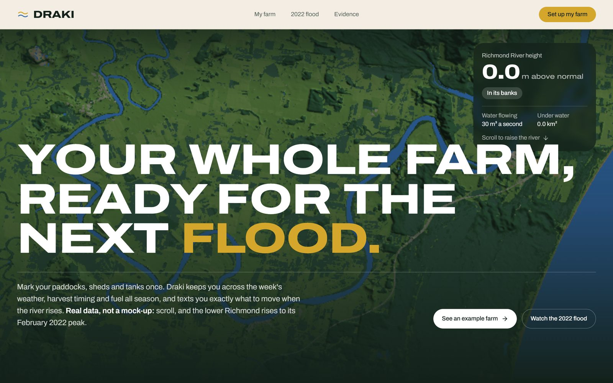
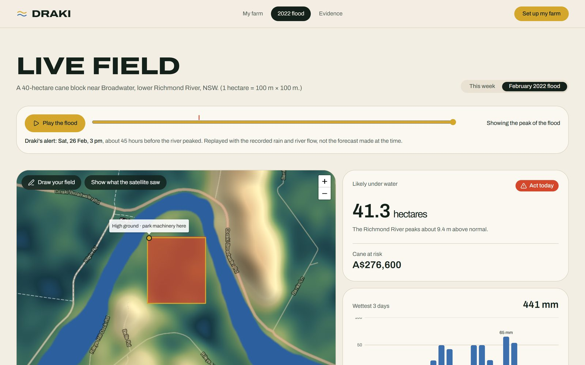
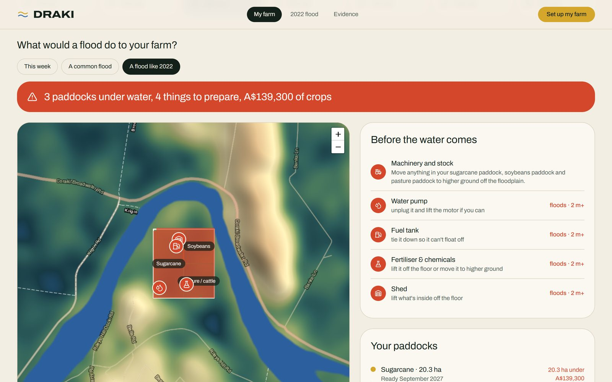
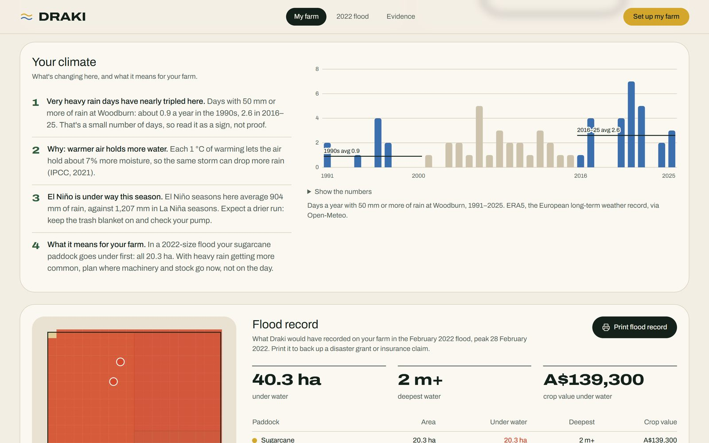
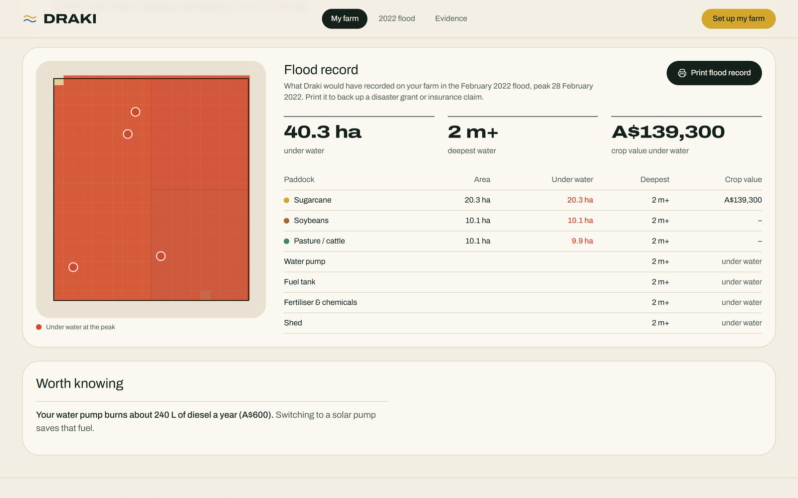
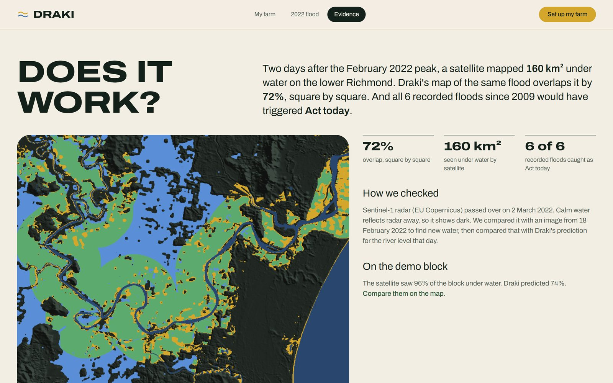

# Draki

[](https://climate-tion.vercel.app)

**Flood warnings for every paddock, not just every district.** Draki tells a farmer which part of their farm goes under when the river rises, texts them what to move before it does, and adds one line on *why* heavy rain keeps getting more common.

**[Live site](https://climate-tion.vercel.app)** · **[Demo video (1:46)](https://drive.google.com/file/d/1PiPDgZrsKXDqs-dYWqz0llZzLaRqvEuu/view?usp=sharing)** · **[Presentation](docs/Draki-presentation.pdf)** · **[Submission text](docs/submission.md)**

| | |
|---|---|
| **Challenge** | Climate Hack-tion 2026, "Build for 2035" |
| **Track** | Climate Awareness & Education |
| **2035 target** | Climate action education for all, and climate-resilient farming (COP31 Action Agenda) |
| **For** | Farmers on floodplains. First users: cane growers on the lower Richmond River, NSW (Coraki, Woodburn, Broadwater) |
| **Team** | Team Pixelers, Australia |
| **Status** | Working prototype, checked against satellite radar and every recorded flood since 2009 |

*Draki* is Fijian for "weather". Our first prototype modelled Fiji's Ba River. Draki runs only on free global data, so the same method can reach Pacific island farms, where field-level flood maps are rare.

## Try it in two minutes

1. **[Example farm](https://climate-tion.vercel.app/#/farm?example)**: a filled-in farm. Switch between *This week*, *A common flood* and *A flood like 2022*, and see which paddocks go under and what to move.
2. **[The 2022 flood, replayed](https://climate-tion.vercel.app/#/live?replay)**: press *Play the flood* and watch the river rise hour by hour. Draki's first *Act today* alert comes about 45 hours before the peak.
3. **[Evidence](https://climate-tion.vercel.app/#/proof)**: the model against Sentinel-1 radar and the flood record.
4. **[Set up your own farm](https://climate-tion.vercel.app/#/farm)**: search your road, tap the corners of your farm, mark paddocks and sheds. Everything stays on your device.

## Screenshots

| | |
|---|---|
| [](https://climate-tion.vercel.app/#/live?replay) | [](https://climate-tion.vercel.app/#/farm?example) |
| **2022 flood replay:** hour by hour, the field fills and *Act today* comes 45 hours before the peak. | **My farm:** what a 2022-size flood does to each paddock (ha and A$), and what to move and tie down. |
| [](https://climate-tion.vercel.app/#/farm?example) | [](https://climate-tion.vercel.app/#/farm?example) |
| **Your climate:** very heavy rain days have nearly tripled; why, and this season's El Niño. | **Flood record:** a printable, per-paddock record of the 2022 flood for disaster grants and insurance. |

[](https://climate-tion.vercel.app/#/proof)

**Evidence:** Draki's 2022 flood map against the Sentinel-1 radar map (72% overlap), and all 6 recorded floods since 2009 caught.

## The problem

- On 28 February 2022 the Wilsons River at Lismore reached **14.4 m**, two metres above the 1954 record (Lismore City Council).
- The Broadwater sugar mill sat under about 3 m of water (A$29m in repairs), and the Northern Rivers cane crush fell 17% (NSW DPI, ABC Rural).
- Very heavy rain days (50 mm+) at Woodburn have nearly tripled: **0.9 a year in the 1990s, 2.6 in 2016–25** (ERA5).
- Flood warnings cover whole districts. They can't tell a farmer that the bottom of *their* block goes under first, or that they have two days to get the gear out.

## What Draki does

**For the farmer, by text.** No app to install. When the river is forecast to rise, the farmer gets a text that says:
- which paddocks will go under, and how deep;
- what to move or tie down (from a fixed playbook and NSW SES advice, never from AI);
- **why**: one line on why heavy rain is getting more common here. Over a season, that's climate education where a farmer will actually read it.

**On the website** (three pages):

- **My farm** (`#/farm`). The farmer, or a mill cane adviser, co-op or family member, sets the farm up once on a map:
  1. **Mark the farm:** search a road or town, then tap the corners. Corners can be dragged, removed or added, with Undo.
  2. **Crops:** draw each paddock by crop (cane, soybeans, pasture, macadamias, vegetables, or anything else).
  3. **Sheds & tanks:** place the things that stay put: sheds, fuel tanks, pumps, chemical stores, the house. Machinery and stock move every day, so Draki names the paddocks that flood and the farmer moves whatever is there.
  4. **Details:** name and mobile.

  Then a personal dashboard:
  - **This week:** the 7-day weather at the farm and the river forecast.
  - **What a flood would do:** this week, a common (about 5-year) flood, or a 2022-size flood. Paddocks under water in hectares and A$, the safe ground to move things to, and a prep step for each fixed thing in the water.
  - **Your year:** planting to harvest for each paddock, with the mill's crushing season.
  - **Your climate:** the local heavy-rain trend, this season's El Niño (El Niño seasons average 904 mm of rain here, La Niña 1,207 mm), and which paddock floods first.
  - **Fuel:** what a diesel pump costs a year, against a solar pump.
  - **Your texts:** the messages the farmer would get, in a phone.
  - **Flood record:** a one-page printable record of what the 2022 flood did to the farm, for a disaster grant or insurance claim.
- **2022 flood** (`#/live`). A demo block, live this week or replayed through February 2022 hour by hour, with the satellite's view of the real flood on top.
- **Evidence** (`#/proof`). How we checked the model, and the full flood record.

**The maps** open on a **ground-height** view, so farmers see where their land dips. Dark is low ground, which floods first. One tap switches to **satellite**, and **3D** tilts the farm over the real terrain (heights ×4).

## Does it work?

| Check | Result |
|---|---|
| **Satellite, tuned:** model vs the Sentinel-1 radar flood map, 2 March 2022 (16,007 ha under water) | **72% overlap** (critical success index). This is the flood the river curve was fitted to, so it's a best fit, not a blind test. |
| **Satellite, blind:** river curve frozen, run on the second 2022 flood, compared with a different radar pass (31 March 2022) | **54% overlap.** Draki caught almost all the water the radar saw and flooded more than it showed, so it leans towards over-warning. This pass covers about 25% of the floodplain (the Coraki side). |
| **Every recorded flood since 2009:** May 2009, Oswald 2013, Debbie 2017, both 2022 floods, Alfred 2025 | **6 of 6** trigger *Act today*, and every *Act today* river peak since 2009 matches a recorded flood (no false alarms) |
| **Lead time** in the 2022 replay | First *Act today* about **45 hours** before the river peaked (replayed with recorded data, not the forecast made at the time) |

## How it works

1. **The land.** Inside the lower Richmond data area, every 30 m square has its elevation (Copernicus GLO-30), its **height above the river** (HAND) and its land cover (ESA WorldCover). These are built by `scripts/build_region.py` and shipped as static files in `web/public/data/richmond/`. Outside the area the app falls back to rain-only flooding on 90 m elevation.
2. **The river.** GloFAS river flow on the Richmond main channel becomes a river level. Live, that's the 7-day forecast and its 50 ensemble runs, which give a flood chance; in the replay, it's the February 2022 record. The river stays in its banks up to its 2-year flood (from 40 years of GloFAS history). Above that, the level curve is fitted to the 2 March 2022 Sentinel-1 flood map. Any square lower than the river floods.
3. **The rain.** The wettest 72 hours of rain pools in the low spots (a "bathtub" fill). Each square takes the deeper of river water and rain water.
4. **The farm.** Each paddock's flooded hectares × its crop value gives A$ at risk. Cane uses NSW DPI figures (125 t/ha × A$55/t); for other crops the farmer enters their own value.
5. **The message.** The share of the farm under water sets the level (*All clear*, *Watch* or *Act today*). The actions come from a fixed playbook, and every text ends with one line on why.

The flood and farm logic is plain TypeScript with no dependencies (`web/src/lib/flood.ts`, `web/src/lib/farm.ts`), each with a runnable self-check.

## Run it locally

```bash
cd web
npm install
npm run dev                     # http://localhost:5173
node src/lib/flood.check.ts     # flood model self-check
node src/lib/farm.check.ts      # farm model self-check
npm run build                   # production build into web/dist
```

Useful links while running: `#/farm?example` (example farm), `#/live?replay` (2022 replay), `#/proof` (evidence).

**Deploy:** `vercel.json` deploys `web/` (Vite) to Vercel as a single service. `scripts/` is offline tooling and isn't deployed.

## Rebuild the data (optional, no API keys)

The site ships with its data already built. To rebuild it:

```bash
python -m venv scripts/.venv
# macOS/Linux: scripts/.venv/bin/…   Windows: scripts/.venv/Scripts/…
scripts/.venv/bin/pip install -r scripts/requirements.txt
scripts/.venv/bin/python scripts/build_region.py           # grids, 2022 replay, Sentinel-1 check, flood record
scripts/.venv/bin/python scripts/build_region.py --blind   # also rerun the blind satellite test
scripts/.venv/bin/python scripts/build_season_data.py      # El Niño / La Niña rain (season.json)
```

## What's in the repo

```
web/                    the website (React + Vite + TypeScript + Tailwind)
  src/App.tsx           landing page, Evidence page, navigation
  src/Farm.tsx          My farm: setup and dashboard
  src/Live.tsx          2022 flood page, and the data loading for a field
  src/lib/flood.ts      flood model: river level, bathtub fill, risk level, playbook
  src/lib/farm.ts       farm model: paddocks, crop value, safe ground, harvest dates
  src/lib/relief.ts     ground-height map tiles, drawn in the browser
  src/components/       maps (FieldMap, Terrain3D), charts, flood record, phone
  public/data/richmond/ shipped data: elevation, height above river, land cover, 2022 replay, validation
  DESIGN.md             the visual system
scripts/                Python that builds the data files (offline, not deployed)
docs/                   idea scoring, build plan, submission text, video script, presentation
vercel.json             Vercel deployment config
```

## Limits and next steps

What it doesn't do yet:
- **Real SMS:** the texts are generated and shown, but not sent, and replies aren't read.
- **Sharper ground:** our height map is satellite-derived at 30 m and includes crop and roof heights. NSW's 1 m LiDAR (ELVIS) and Bureau of Meteorology river gauges would beat 30 m elevation and the global GloFAS model.
- **Advice review:** the playbook needs review by a cane adviser.
- **More regions:** only the lower Richmond has the full river model. Next is a Pacific region, starting with Fiji's Ba River, rebuilt with the same script.

Done:
- [x] Live forecast, river model, 30 m elevation and land cover, flood fill, text preview
- [x] February 2022 flood replay, hour by hour
- [x] Validation: Sentinel-1 overlap (72% tuned, 54% blind), 6 of 6 recorded floods, no false alarms since 2009
- [x] River forecast ensemble turned into a flood chance
- [x] My farm: editable setup on the map, flood impact per paddock and fixed item, harvest timeline, your climate, fuel, texts, printable flood record
- [x] Ground-height, satellite and 3D map views

## Team (Australia)

- **Siddhant Malik:** the idea and research.
- **Peter Ma:** the website and flood model.
- **Adin Sreekesh:** combined both into the final entry.

## Tools used

Every outside tool, dataset, API, library and AI tool (required for submission).

**Data**

| What | Used for | Licence / terms |
|---|---|---|
| [Open-Meteo](https://open-meteo.com) forecast, archive (ERA5), elevation and flood APIs | Rain forecast, 2022 flood replay, heavy-rain days, elevation outside the data area, river flow | CC BY 4.0 |
| GloFAS v4 river discharge (Copernicus Emergency Management Service, via the Open-Meteo Flood API) | Richmond River flow: history, 7-day forecast, 50-member ensemble | CC BY 4.0 |
| Copernicus DEM GLO-30 (via Microsoft Planetary Computer) | 30 m elevation and height above the river for the lower Richmond | Copernicus DEM licence |
| Copernicus GLO-90 DEM (via Open-Meteo) | Elevation for fields outside the data area | Copernicus licence |
| ESA WorldCover 2021 v200 (via Microsoft Planetary Computer) | Land cover: only farmland counts toward cane at risk; rivers on the ground-height map | CC BY 4.0 |
| Sentinel-1A RTC radar (Copernicus, via Microsoft Planetary Computer) | Flood maps of 2 March and 31 March 2022, used to fit and check the model | Copernicus Sentinel data terms |
| NOAA CPC Oceanic Niño Index (ONI) | El Niño / La Niña phase, now and for every season since 1991 | US Government public domain |
| AWS Terrain Tiles (Mapzen Terrarium; SRTM, GMTED and other open sources) | The ground-height map (coloured and shaded in the browser) and the shape of the 3D view | Open data, attribution shown on map |
| OpenStreetMap Nominatim search | "Find your farm" in My farm setup | ODbL, © OpenStreetMap contributors, light-use policy |
| Esri World Imagery; World Transportation; World Boundaries and Places | Satellite view; roads and place names | Esri terms, attribution shown on map |

**Facts and figures cited**

| What | Used for | Where |
|---|---|---|
| Flood records: Lismore City Council, ABC, FloodList, Richmond Valley Council, AIDR Knowledge Hub, Australian Severe Weather archive | Dates of recorded floods for validation; "14.4 m, two metres above the 1954 record of 12.27 m" | Evidence page, demo video |
| NSW DPI (two-year cane 105–150 t/ha; 2024 average A$55/t); Sunshine Sugar (crushing season) | Cane value at risk, harvest timing | `web/src/lib/flood.ts`, `web/src/lib/farm.ts` |
| NSW DPI Primary Industries Insights 2023 (sugarcane); ABC Rural, 6 Sep 2022 | What 2022 cost: crush 1.33 Mt, 17% lower; Broadwater mill under ~3 m of water, A$29m repairs, 40,000 t of cane sent to other mills | Landing page |
| Australian average pump prices, October 2026 (AIP / dailyfuels) | Fuel cost | `web/src/lib/farm.ts` |
| NSW SES flood advice | Prep for fixed items, e.g. "tie fuel tanks down so they can't float off" | `web/src/lib/farm.ts` |
| disasterassist.gov.au | Help to claim after a flood | My farm page |

**Code**

| What | Used for | Licence |
|---|---|---|
| React, Vite, TypeScript, Tailwind CSS | The website | MIT |
| shadcn/ui (Base UI), lucide-react, `cn` | UI components, icons | MIT / ISC |
| Leaflet, react-leaflet | Flat maps | BSD-2 / Hippocratic-2.1 |
| MapLibre GL JS | 3D map (loaded only when 3D is pressed) | BSD-3-Clause |
| devices.css (picturepan2) | Phone frame around the example texts | MIT |
| Fontsource: Archivo | Typography | SIL OFL |
| Python: numpy, scipy, rasterio, pystac-client, planetary-computer, requests | Building the data files | BSD / MIT / Apache-2.0 |
| Playwright (playwright-core, driving local Chrome) | Testing the site by clicking through it; screenshots for the demo video. Not shipped | Apache-2.0 |
| Vercel | Hosting | Vercel terms |

**Images, video and AI (disclosed)**

| What | Used for | Licence / terms |
|---|---|---|
| Unsplash photos: Troy Olson (storm over field), insung yoon (flooded farmland), Christine Walker (cane harvest) | Imagery, credited on the site | Unsplash License |
| Claude Code (Anthropic, Claude Opus) | AI coding assistant: scaffolding, model code, page build, design, demo video edit | Disclosed per hackathon rules |
| Claude Code skills: Impeccable (design critique and polish); Emil Kowalski's `animate` and `find-animation-opportunities` ([emilkowalski/skills](https://github.com/emilkowalski/skills)) | Design review and motion guidance for the AI assistant | Emil's skills MIT, licence kept in `.claude/skills/` |
| Microsoft Edge neural text-to-speech (voice en-AU-WilliamMultilingualNeural, via the `edge-tts` Python package) | AI-generated voiceover for the demo video | edge-tts GPL-3.0; Microsoft voice service terms |
| FFmpeg (via `imageio-ffmpeg`), Pillow | Editing the demo video: inserts, zooms, crossfades, voiceover and music mix, captions | LGPL/GPL, MIT-CMU |
| numpy | Synthesising the video's background music (original, made for this video; no samples or licensed tracks) | BSD-3-Clause |

The demo video is built on the team's "Draki Reveal" animation, with footage of the live site captured with Playwright. Captions are embedded in the video. The script and timings are in [docs/voiceover.md](docs/voiceover.md).

## Licence

The code is under the [MIT License](LICENSE), © 2026 Peter Ma, Siddhant Malik and Adin Sreekesh. Third-party data, photos, fonts and libraries keep their own licences (see Tools used).

## No prior work

All code, design and assets were created after 9:00am AEST, Fri 2 Oct 2026. Only ideas and research (`docs/`) came before.
